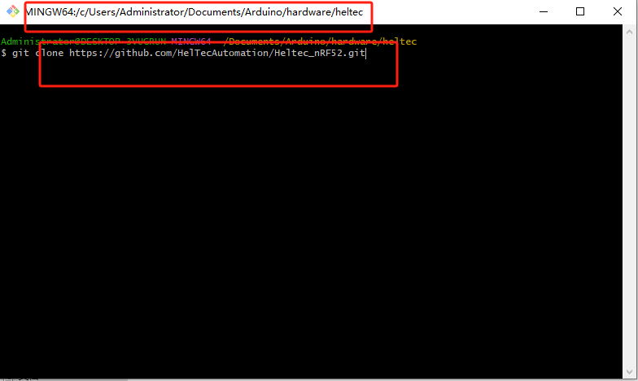
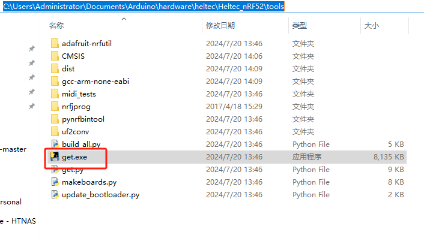
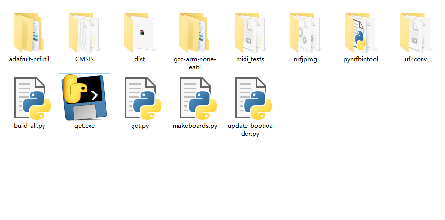
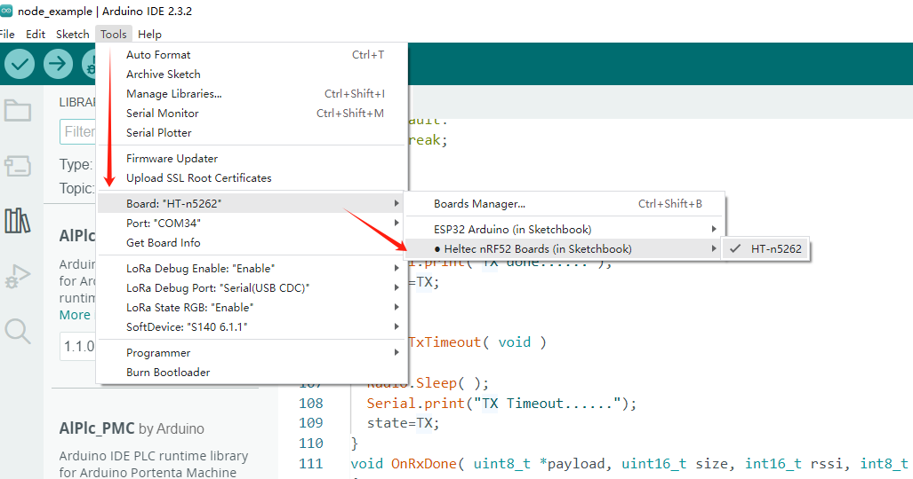
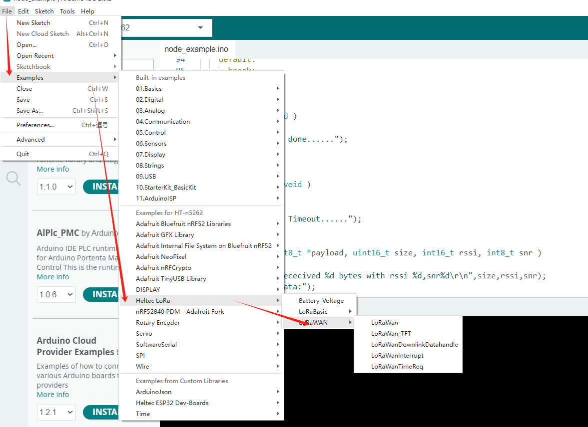
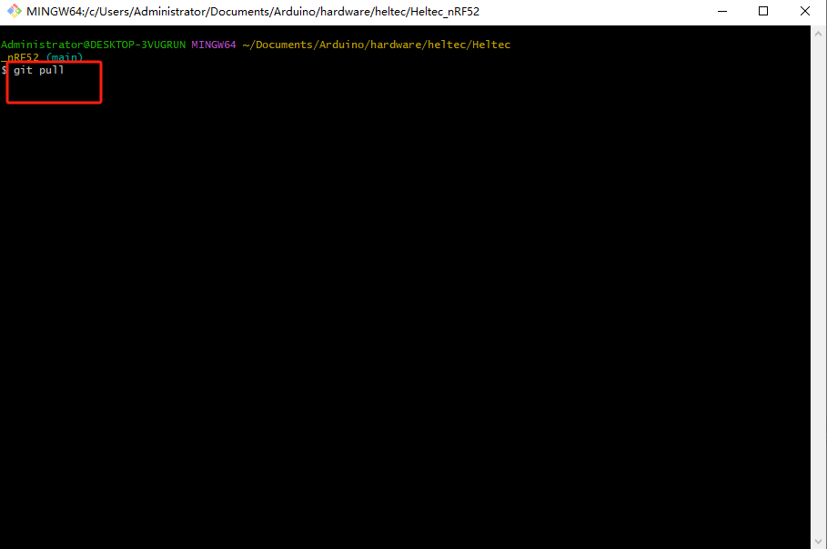

# Steps to install Heltec ESP32&ESP8266 Arduino support on Windows
**Tested on 32 and 64 bit Windows 10 machines**

Before operation, please make sure Git and Arduino are correctly installed on you computer. If not, please refer to this document: [How to install Git and Arduino IDE](https://heltec-automation-docs.readthedocs.io/en/latest/general/how_to_install_git_and_arduino.html)

&nbsp;

**Executed commands MUST under the ```[YOUR_USER_NAME]/Documents/Arduino/hardware/heltec``` path!**

- Open a ```Git Bash``` session pointing to ```[YOUR_USER_NAME]/Documents/Arduino/hardware/heltec``` and execute `git clone https://github.com/HelTecAutomation/Heltec_nRF52.git`

&nbsp;

## Finish Arduino ESP32 support on Windows

Open `/Documents/Arduino/hardware/heltec/Heltec_nRF52/tools` and double-click `get.exe`



When `get.exe` finish, the folder should like this:



Connect your board to computer via a high quality USB cable

1. Start Arduino IDE

2. Select your board in ```Tools > Board``` menu.

   

3. Select the COM port that the board is attached to.

4. Compile and upload (You might need to hold the ```PRG``` button while uploading)



&nbsp;

## Update to the latest code

Open ```/Documents/Arduino/hardware/heltec/Heltec_nRF52``` created start ```Git Bash``` and input ```git pull```!



Wait for git to pull any changes and close `Git Bash`.

Open `/Documents/Arduino/hardware/heltec/Heltec_nRF52/tools` and double-click `get.exe`.